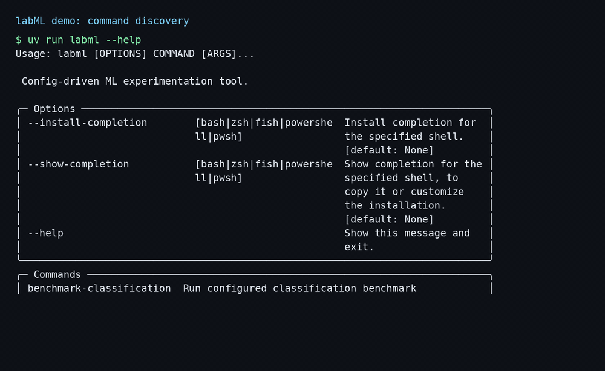
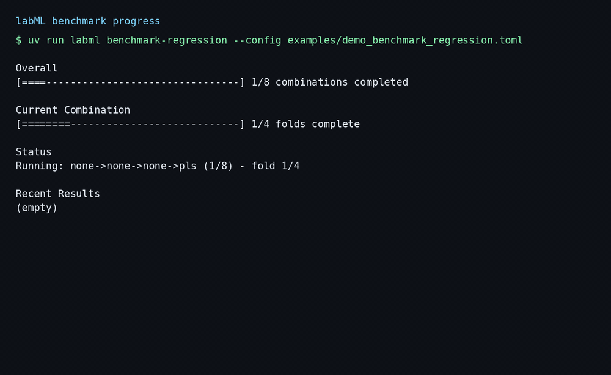

 

# Laboratory of Machine Learning





labML is a config-driven CLI for reproducible ML experimentation.
The workflow has two stages: generate reusable artifacts once, then run benchmark combinations for regression or classification.

The benchmark internals are now split into focused layers: runtime context building, execution engine, planning/estimation, progress reporting, and output shaping.

Current benchmark module layout:

- `labml/core/benchmark.py`: public API + high-level orchestration.
- `labml/core/benchmark_models.py`: shared dataclasses/types.
- `labml/core/benchmark_context.py`: config/input/search expansion and runtime context.
- `labml/core/benchmark_engine.py`: fold/combinations execution engine.
- `labml/core/benchmark_plan.py`: `inspect-config` planning and runtime estimation.
- `labml/core/benchmark_progress.py`: progress reporter interface and Rich/Null implementations.
- `labml/core/benchmark_results.py`: result aggregation, metadata, and output payload.

Public surface note: `labml/core/benchmark.py` is the stable API entrypoint (`run_benchmark`, `inspect_benchmark`). The `benchmark_*` modules are internal implementation modules.

## Commands

- `prepare`: loads input data, applies an optional Python hook, and exports reusable artifacts.
- `benchmark-regression`: runs configured pipeline combinations for regression.
- `benchmark-classification`: runs configured pipeline combinations for classification.
- `inspect-config`: inspects benchmark config and estimates runtime from search space plus machine profile.

Quick command list:

```bash
uv run labml --help
```

## Installation

```bash
uv sync --extra dev
```

## End-to-end usage

Prepare artifacts:

```bash
uv run labml prepare --config examples/prepare.toml
```

Run a regression benchmark:

```bash
uv run labml benchmark-regression --config examples/benchmark_regression.toml
```

Preview workload without training:

```bash
uv run labml benchmark-regression --config examples/benchmark_regression.toml --dry-run
```

Inspect benchmark plan with machine-aware runtime estimate:

```bash
uv run labml inspect-config --config examples/benchmark_regression.toml --task regression
```

Run a classification benchmark:

```bash
uv run labml benchmark-classification --config examples/benchmark_classification.toml
```

Preview classification workload without training:

```bash
uv run labml benchmark-classification --config examples/benchmark_classification.toml --dry-run
```

## Artifacts generated by `prepare`

The prepare stage writes portable files that can be moved to another machine:

- `data.parquet`
- `folds.csv` (`row_id,fold_id`)
- `metadata.json`

## Progress interface (benchmark)

During benchmark runs, the CLI shows four live panels:

- `Overall`: global progress over all combinations.
- `Current Combination`: fold-level progress for the active combination.
- `Status`: current spinner/status message for the running combination.
- `Recent Results`: rolling history (last 10) with visual status marks:
  - `✅` successful combinations
  - `⚠` skipped combinations
  - `✖` failed combinations

This makes it easier to know exactly where the run is and what just happened.

From an engineering perspective, benchmark progress is decoupled from execution through a `ProgressReporter` interface. The default CLI experience uses `RichProgressReporter`, and non-interactive contexts can use `NullProgressReporter`.

`[evaluation].n_jobs` is now applied during fold evaluation (`-1` uses all available CPU cores).
When `n_jobs > 1`, labML also applies an inner parallelism guard: estimators that expose `n_jobs` are forced to `1` unless you explicitly set `n_jobs` for that estimator in the config.

## Error taxonomy (benchmark)

Benchmark failures are classified with stable `error_type` values in the `failed` sheet:

- `incompatible_combo`: expected skips (for example, incompatible NMF combinations).
- `model_execution`: recoverable model fit/score errors for one combination.
- `internal`: unexpected internal errors (propagated fail-fast).

Configuration/data errors (`config_data`) fail fast before execution starts and do not generate output files.

## Excel + LaTeX export

Benchmark outputs are always written to Excel. You can also ask the tool to generate LaTeX `tabular` files ready for `\\input{...}` in your paper.

LaTeX export uses pandas Styler rendering (via `Jinja2`, included in project dependencies).

Example output block:

```toml
[output]
file = "_artifacts_/benchmarks/regression/results.xlsx"
latex = true
latex_dir = "_artifacts_/benchmarks/regression/latex"
```

When `latex = true`, the benchmark writes:

- `<excel_stem>_ranking.tex`
- `<excel_stem>_summary.tex`

Both tables are rendered as `tabular` and rounded to 4 decimals.

## Configuration examples

Ready-to-run examples are in `examples/`:

- `examples/prepare.toml`
- `examples/benchmark_regression.toml`
- `examples/benchmark_classification.toml`
- `examples/demo_data.csv`
- `examples/demo_data_classification.csv`
- `examples/demo_prepare.toml`
- `examples/demo_benchmark_regression.toml`
- `examples/demo_benchmark_regression_parallel.toml`

These examples are self-contained and runnable from repo root with `uv run labml ...`.

For a full option-by-option TOML reference (required/optional fields, defaults, valid values, and search-space syntax), see `docs/configuration.md`.

Parameter values support:

- single values (`0.1`)
- lists (`[0.1, 1.0, 10.0]`)
- ranges (`"1:0.1:2"`, inclusive)

## Tests

Run all unit and integration tests:

```bash
uv run python -m pytest -q
```

Current status in this repository snapshot: `88 passed`.

## Regenerate demo GIFs

The GIF generation is reproducible and uses FFmpeg.

```bash
scripts/demo/build_gifs.sh
```

This command regenerates:

- `labml-demo.gif`
- `labml-progress.gif`
